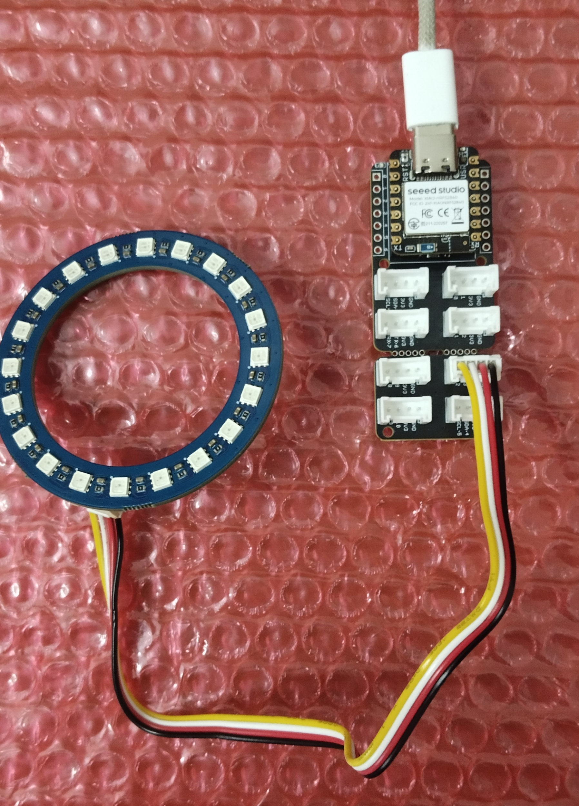

# XIAO nRF52840 Matter Demo

This repo contains everything you need to get started with matter on XIAO nRf52840 Series

## Prerequisites

* **Hardware**

    * USB Type C Cable
    * Micro USB Cable
    * XIAO nRF52840 Or XIAO nRF52840 Sense board
    * nRF52840 DK (i.e Thread radio coprocessor)
    * [Seeed Studio Grove Base for XIAO](https://www.seeedstudio.com/Grove-Shield-for-Seeeduino-XIAO-p-4621.html)
    * [Grove - RGB LED Ring (20 - WS2813 Mini)
](https://www.seeedstudio.com/Grove-RGB-LED-Ring-20-WS2813-Mini.html)

* **Hardware**

    * Linux OS (preferably Ubuntu)
    * nRF Connect SDK v2.9.0  (You can download it via VS Code Extension)
    * Segger J-Link v7.94i or higher

You are welcome to follow Nordic's [instructions](https://www.nordicsemi.com/Products/Development-software/nrf-connect-sdk) for setting up the nRF Connect SDK

## Project Setup 

```bash
# Get the xiao_nrf52840 matter_demo
$ git clone https://github.com/narangmayank/xiao_nrf52840_matter_demo

# Step into the project directory
$ cd xiao_nrf52840_matter_demo
```

Lets get started now :)

## 1. Matter Light Node

Here I'm using for XIAO nRF52840 Sense for demo. In case you are using XIAO nRF52840 board apply the changes accordingly, mentioned in comments for your ease. 

### Prepare the hardware

Attach the XIAO nRF52840 Sense Board to Grove base board and connect the Grove ove RGB LED ring to D2 pin extension. Once done, the matter light node hardware will look like below,



### Flashing firmware

You can either flash the pre-compiled binaries provided in the `hex` directory or you can build the firmware yourself. Use pre-compiled HEX files for your target to get started quickly

**Using pre-compiled binary**

```bash
# Flash hex file using nrfjprog (Use hex\xiao_nrf52840_light_bulb_merged.hex for XIAO nRF52840 board)
$ nrfjprog -f nrf52 --program hex\xiao_nrf52840_sense_light_bulb_merged.hex --sectorerase

# Reset to apply the new FW
$ nrfjprog --reset
```

OR

**Generating binary (Using West)**

```bash
# Step into matter light node project
$ cd xiao_light_bulb

#  Build the light bulb sample (Use xiao_ble/nrf52840 for XIAO nRF52840 board)
$ west build -p -b xiao_ble/nrf52840/sense

# Flash the binary
$ west flash --erase
```

Once done, You should see XIAO inbuilt RGB light blinking (BLUE) which means matter light node firmware is running now, started bluetooth advertising by `Matter_Light` name and waiting for commisioning.

## 2. Setup OTBR (OpenThread Border Router)

Please follow the instructions in [OTBR_SETUP.md](./OTBR_Setup.md) to set up the OpenThread Border Router (OTBR) and create the thread network on your linux machine.

Once OTBR is running and the Thread network is established, proceed with the matter controller node setup below to commission and control the Matter light node.

## 3. Matter Controller Node

We will be using matter chip tool as a matter controller node to run this demo.

### Get the Chip Tool Binary

Download the latest chip tool binary for linux from the below github
https://github.com/nrfconnect/sdk-connectedhomeip/releases

Give executbale permission via `chmod +x ./chip-tool_x64`

Usage `./chip-tool_x64`

### Node Commissioning

Before running any Matter commands, you must **commission the node to the thread network**. Use the following command to commission your node

**Notes on parameters:**

* `node_id` is user-configurable and you can use any unique integer to identify your device on the network (e.g., 1, 2, etc.)
* `operational_dataset_hex` is obtained from the **OTBR Setup**
* `pincode` is  specific to the node firmware. For the Matter Light Bulb node, the default is **20202021**
* `discriminator` is specific to the node firmware. For the Matter Light Bulb node, the default is **3840**

```bash
# Matter thread node commissioning via BLE
./chip-tool_x64 pairing ble-thread <node_id> hex:<operational_dataset_hex> <pincode> <discriminator>
```

### Control the Matter Light Node

Once the node is commissioned, you can control it using standard Matter OnOff cluster commands

**Notes on parameters:**

- `node_id` is assigned during commissioning  
- `endpoint_id` is specific to the node firmware. For the Matter Light Bulb node, the default is **1**.

```bash
# Turn ON LED
./chip-tool_x64 onoff on <node_id> <endpoint_id>

# Turn off LED
./chip-tool_x64 onoff off <node_id> <endpoint_id>

# Toggle the LED state
./chip-tool_x64 onoff toggle <node_id> <endpoint_id>
```